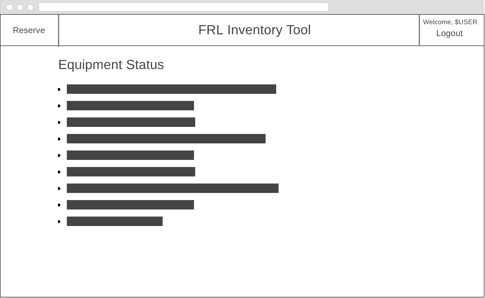

# EquipReality

## Overview
A CS research lab can move fast.  Technology never stops advancing, so your team can't stop either.  Sometimes, equipment can get left behind in your wake.  Administrating such a team requires focus and organization.  EquipReality is here to help your team organize itself.

EquipReality is a web app that will help members of a research lab to maintain the order of their gear.  Members can register with admin approval and log in.  Once signed in, they can view the availablity of the equipment their team owns, and put in requests to check out said gear.  The admin maintains as much control over the transactions as they want!

## Data Model

The application will store Users, Items, and Requests

* Users can have multiple Requests via reference
* Requests can have multiple Items via reference
* Each Item represents a single object (or set of related objects--e.g. a full HTC Vive setup)

An Example User:

```javascript
{
  username: "ronaldresearcher",
  hash: // a password hash,
  fullname: "Ronald Researcher",
  email: "ronald@research.edu",
  requests: [] //a list of references to this user's Requests
}
```

An Example Request:

```javascript
{
  name: "SIGGRAPH 2018", //optional, defaults to timestamp
  user: //reference to User who filed this Request
  external: true, //requesting to remove items from the lab
  filed: //UNIX time of when this request was filed
  started: //UNIX time of beginning of term
  duedate: //UNIX time of end of term, or Infinity if indefinite & internal
  items: [] //list of references to items inclueded in Request
  approved: true //admin approval, defaults to undefined
}
```

An Example Item:

```javascript
{
  name: "HTC Vive Tracker",
  label: "8", //a physical label applied to the item
  location: "Rightmost cabinet by Bay 1", //where to pick up/return item 
  available: false //is currently unused
}
```


## [Link to Commented First Draft Schema](db.js) 

## Wireframes

/home - homepage and equipment overview



/calendar - availability calendar for an item


/reserve - form to create a new reservation request


/reserve/past - view all your past reservation requests


/login - login/registration page


/admin - admin controls for the application


## Site map

(___TODO__: draw out a site map that shows how pages are related to each other_)

Here's a [complex example from wikipedia](https://upload.wikimedia.org/wikipedia/commons/2/20/Sitemap_google.jpg), but you can create one without the screenshots, drop shadows, etc. ... just names of pages and where they flow to.

## User Stories or Use Cases

1. As a non-registered user with an invite email from the admin, I can register for a new account
2. As a user, I can log in to the website
3. As a user, I can view all equipment tracked by the service
4. As a user, I can view an availability calendar for any given item
5. As a user, I can place an equipment reservation order to be approved by the admin
6. As a user, I can request either an in-lab reservation for an indefinite amount of time or an out-of-lab reservation for a maximum term of two weeks
7. As a user, I can see a list of all my past approved and denied reservation requests
8. As a user, I can view my approved reservations and will be notified of their approval via email
9. As a user, I will receive an email at the end of a reservation term reminding me to return my equipment
10. As a user, I can declare in the app that I've returned my items at any point during a reservation term
11. As an admin, I can send invite emails
12. As an admin, I can approve reservation requests
13. As an admin, I can see a list of all users and their reservations
14. As an admin, I am notified via email of any past-due reservations
15. As an admin, I can configure the application settings (e.g. enable auto request approval, change maximum term lengths, etc.)

## Research Topics

* (5 points) Integrate user authentication
    * I'll use Passport.js for user authentication
    * Since this app will be organization-exclusive, all registrations will require admin approval
    * I'll deploy a "fake" version of the site (with a separate database from the one I'll be using for my lab) to NYU servers
    * This fake deployment will include a test account for graders
* (2 points) Use a CSS framework
    * I plan to use Bootstrap.
* (2 points) Use a server-side JavaScript module
    * To manage admin email, I plan to use the Nodemail package
* (2 points)  For external APIs
    * My team is on Slack, so I plan to include integrations for that service.
    * I don't anticipate this to be too hard to implement, but I may be surprised!  Will change point value accordingly if this turns out to be the case.

11 points total out of 8 required points


## [Link to Initial Main Project File](app.js) 

## Annotations / References Used

1. [passport.js authentication docs](http://passportjs.org/docs) - (add link to source code that was based on this)
2. [Slack API documentation](https://api.slack.com/internal-integrations) - (add link to source code that was based on this)
3. [Nodemail documentation](https://nodemailer.com/usage/)
4. More to come as development continues!
